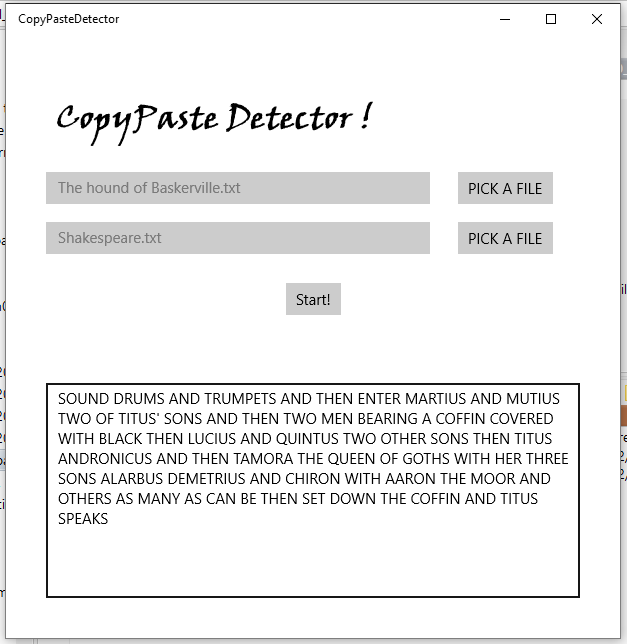

# Pràctica Copy-Paste detector

__OBJECTIU:__ Donats dos arxius de text, hem de trobar la frase més llarga que tenen un comú.
L'usuari selecciona amb un File Picker els arxius, un cop seleccionats dos arxius a comparar, el botó _Start_ s'activa. Al prémer _Start_ , el programa busca la frase més llarga compartida als dos arxius, i la mostra a la capsa de text inferior.



Arxius de prova proporcionats:
 * [Shakespeare.txt](resources/Shakespeare.txt)
 * [The hound of Baskerville.txt](resources/The hound of Baskerville.txt)

Recordeu, haurem d'ignorar salts de línia, espais, comes, punts, punts i comes i dos punts. També ignorarem diferències de majúscules i minúscules.

## Codi proporcionat 

Es proporciona el codi que permet obrir un selector d'arxius, llegir-lo i desar-lo
en un string.

```c#
		/// How to program a File Picker, and read the selected file
		/// into a string.
        private async void btnFile1_Click(object sender, RoutedEventArgs e)
        {
            FileOpenPicker fp = new FileOpenPicker();
            fp.FileTypeFilter.Add(".txt");
            fp.FileTypeFilter.Add(".rtf");

            StorageFile sf = await fp.PickSingleFileAsync();
            string textReadFromFile = await readTextFile(sf);
            
			// ..... YOUR CODE HERE ...........
        }
		
		

        /// <summary>
        /// Read the storage file in text mode, returning it as string.
        /// Carriage return and line feed are supressed, and replaced by spaces.
        /// </summary>
        /// <param name="sf"></param>
        /// <returns></returns>
        private async Task<string> readTextFile(StorageFile sf)
        {
            StringWriter sw = new StringWriter();
            IRandomAccessStream stream = await sf.OpenAsync(FileAccessMode.Read);
            using (StreamReader streamReader = new StreamReader(stream.AsStream()))
            {
                string line;
                while ((line = streamReader.ReadLine()) != null)
                {
                    //txt += line + Environment.NewLine;
                    sw.Write(line + " ");
                }

                return sw.ToString();
            }
        }
		
```		