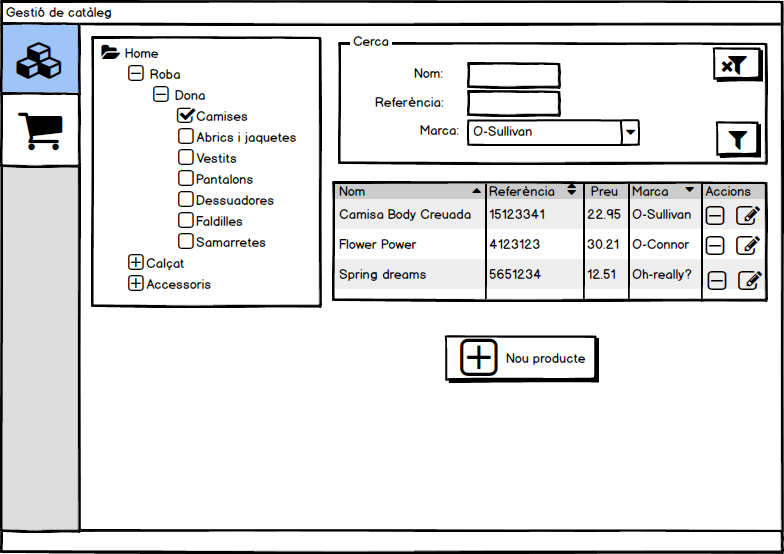

# Pràctica d'Accés a Dades

## Introducció

El nostre client desitja construir una aplicació per gestionar el catàleg de productes d'una botiga de roba, calçat i complements.
L'analista, després d'una reunió amb el client, ha preparat una maqueta de les pantalles que cal crear inicialment. Sobre aquestes pantalles el client
valorarà si desitja continuar amb el projecte.

Per accelerar el procés de construcció de l'aplicació, es construirà una maqueta que funcionarà amb una simple base de dades SQLite. Més endavant caldria accedir a un servidor extern, però això queda fora de l'àmbit d'aquesta pràctica.

Per facilitar-nos la feina, l'analista també ens proporciona  un esquema relacional de la base de dades. Amb ell us serà fàcil escriure un script SQL de creació de BD adaptat a la sintaxi SQLite. També caldrà que confeccioneu un script d'insercions per crear un joc de dades amb varies categories i productes. Això agilitzarà les vostres proves.

## Pantalles
Caldrà construir tres pantalles, dues es corresponen al Backoffice, que seria la gestió de catàleg que fa el propietari de la botiga, i l'altre al front-office, que equivaldria a la App que veuria el client.

### Pàgina 1.0 / Backoffice > Gestió del catàleg

En aquesta pantalla l'administrador pot llistar els productes, fer cerques, esborrar, crear i editar nous productes. L'edició i la inserció es fan la pàgina 1.1

### Pàgina 1.1 / Backoffice > Edició i alta de productes

La pantalla permet editar i donar d'alta productes. Cada producte té múltiples camps, i cal assegurar la integritat de les dades abans de poder desar els canvis. L'aplicació marcarà en tot moment els camps que resten per completar o que tenen dades incorrectes ( mostreu un missatge o una icona al costat del camp erroni, i useu un color de fons al control per indicar que és erroni/incomplet )
Per tal que un producte sigui correcte cal que:
* tots els camps obligatoris estiguin degudament complimentats
* que hi hagi com a mínim un color
* que hi hagi com a mínim una foto per a cada color.

### Pàgina 2.0 / Frontoffice > Catàleg de productes

## Model de base de dades
A continuació es mostra la base de dades que caldrà fer servir per l'aplicació.
Tingueu especial cura amb:
* els tipus de dades
* els camps obligatoris/opcionals
* les claus primàries (PK)
* les claus foranes  (FK)
* les claus alternatives (AK) 

Tingueu en compte que la taula de productes haurà de tenir el camp prod_id autonumèric per facilitar l'inserció de registres.
La taula _color_ és feble de _producte_, mentre que _foto_ és feble de _color_. Els camps *_num són ordinals que han de comptar les ocurrències.

L'arbre de categories es munta de forma reflexiva, on cada categoria apunta a una categoria pare. La categoria arrel no apunta a cap (NULL)

